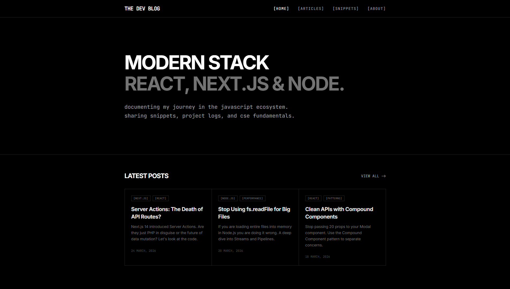

  <h1>THE DEV BLOG</h1>
  

## ABOUT
This blog is where I share deep technical dives, architectural patterns, and practical code snippets. The goal is to document the journey of a CSE student and Full Stack Developer while providing reusable snippets for the developer community. No tracking. No ads. Just code.

## TECH STACK
* **Frontend:** React, TypeScript, Vite
* **Styling:** Tailwind CSS
