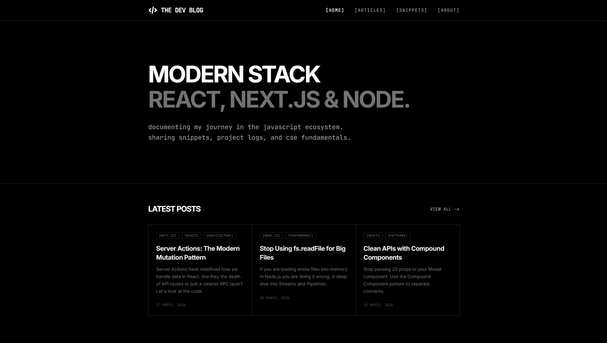
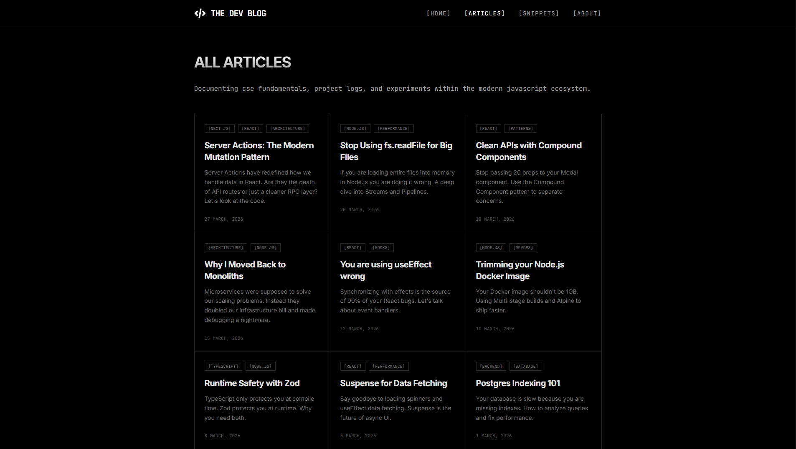
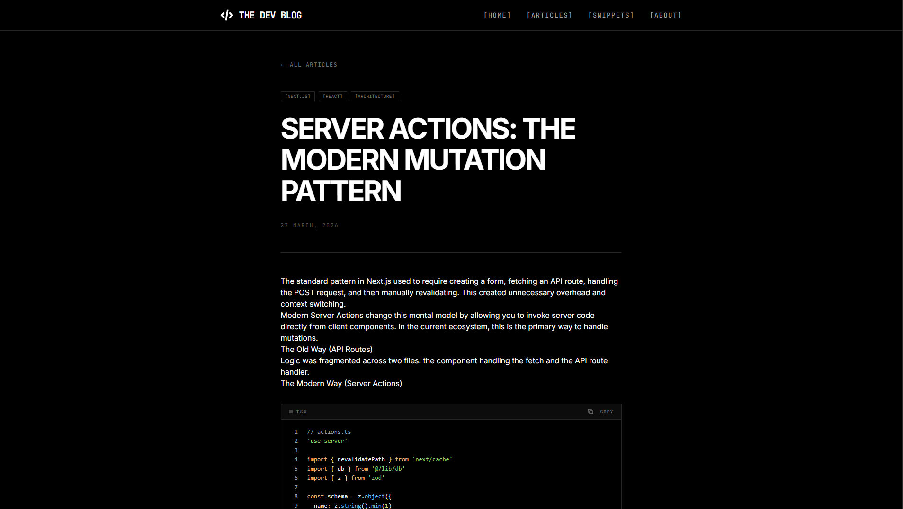
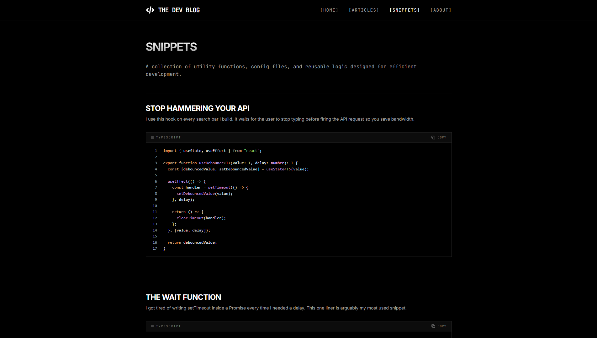

<div align="center">
  <h1>THE DEV BLOG</h1>
</div>

## ABOUT

This blog is where I share deep technical dives, architectural patterns, and practical code snippets. The goal is to document the journey of a CSE student and Full Stack Developer while providing reusable snippets for the developer community. No tracking. No ads. Just code.

<div align="center">
<p>
  <a href="https://thedevblog.kawsar.dev/">
    
  </a>
  <a href="https://github.com/kawsarcodes/the-dev-blog">
    
  </a>
</p>
</div>

## TECH STACK

   


## PROJECT STRUCTURE

```text
src/
├── assets/             # Images and static files
├── components/         # Reusable UI elements
│   ├── articles/       # Article related components
│   ├── layout/         # Header, Navbar, Hero sections
│   └── ui/             # Core UI components
├── data/               # Blog posts and snippets content
├── lib/                # Utility functions and helpers
├── pages/              # Main application pages
└── styles/             # Global CSS and Tailwind configurations
```

## PAGES

<div align="center">
  <a href="https://thedevblog.kawsar.dev/">
    
  </a>
  <a href="https://thedevblog.kawsar.dev/">
    
  </a>
  <a href="https://thedevblog.kawsar.dev/">
    
  </a>
  <a href="https://thedevblog.kawsar.dev/">
    
  </a>
</div>

## GETTING STARTED

```bash
# Clone the repository
git clone https://github.com/kawsarcodes/the-dev-blog.git
```

```bash
# Install dependencies
npm install
```

```bash
# Run the dev server
npm run dev
```
